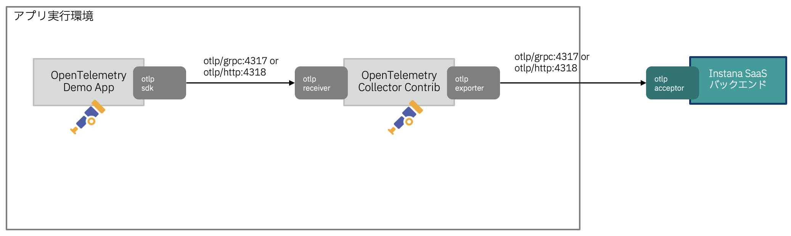
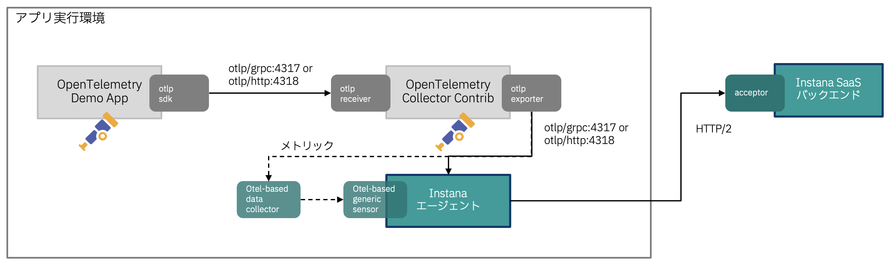

# Instana - OpenTelemetry 連携パターン
OpenTelemetryデータをInstanaバックエンドに送信するにあたり、Instanaエージェント有無の2パターンを試しました。

## 連携パターン1
OpenTelemetry Collectorのotlp exporterによりInstanaバックエンドに直接送信します。
トレース・メトリック・ログすべて同じ方法で送信可能です。
InstanaバックエンドはOTLP専用のエンドポイントにてOTLPデータを受信します。
OTLP/gRPC, OTLP/HTTPそれぞれ対応しています。

サンプルファイル
|ファイル名  | 配置先のパス  |
|---|---|
|[docker-compose.yml][1-1]  | opentelemetry-demo/docker-compose.yml |
|[.env][1-2]  | opentelemetry-demo/.env|
|[otelcol-config.yml][1-3]  | opentelemetry-demo/src/otelcollector/otelcol-config.yml |

[1-1]:without_agent/docker-compose.yml
[1-2]:without_agent/.env
[1-3]:without_agent/otelcol-config.yml

## 連携パターン2
Instanaエージェント経由でInstanaバックエンドに送信します。
トレース・メトリック・ログすべて同じ方法で送信可能です。
InstanaエージェントがOTLPデータを受信し、通常のバックエンドとの通信においてOTLPデータを送信します。

サンプルファイル
|ファイル名  | 配置先のパス  |
|---|---|
|[docker-compose.yml][2-1]  | opentelemetry-demo/docker-compose.yml |
|[.env][2-2]  | opentelemetry-demo/.env|
|[otelcol-config.yml][2-3]  | opentelemetry-demo/src/otelcollector/otelcol-config.yml |
|[configuration_otel.yaml][2-4]  | /opt/instana/agent/etc/instana/configuration_otel.yaml |
|[configuration_disable-instana-tracing.yaml][2-5]  | /opt/instana/agent/etc/instana/configuration_disable-instana-tracing.yaml |

[2-1]:with_agent/docker-compose.yml
[2-2]:with_agent/.env
[2-3]:with_agent/otelcol-config.yml
[2-4]:with_agent/configuration_otel.yaml
[2-5]:with_agent/configuration_disable-instana-tracing.yaml